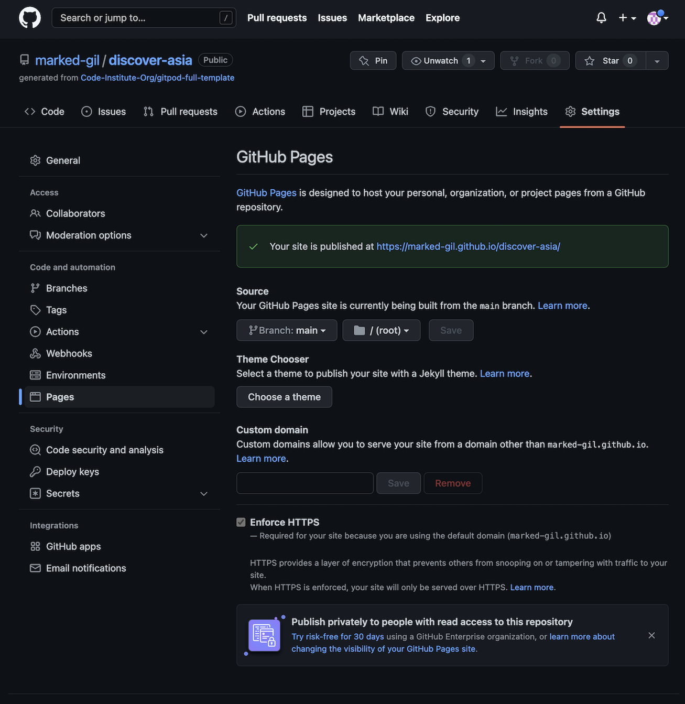

# DISCOVER ASIA TRAVEL AGENCY

Discover Asia is a travel agency website created to showcase to travel enthusiasts what this amazing agency can offer them for their next holiday trip. It desires to focus on holidaymakers who don't just want to simply travel, but to travel with convenience, style and luxury through the agency's personalized VIP services. And it aims to entice luxury travelers to choose Asia and get in touch with Discover Asia by presenting it with the utmost consideration for user experience.

<!-- Responsive Sample Image Here -->
---
## Features
---
### Existing Features

* **Navigation Bar**

    The navigation bar contains 2 main divisions of links to other pages or major sections of the website - the **logo** and the **nav menu**. This navigation bar is displayed in all pages of the website for easy and convenient routing.

    * Logo
    
        The logo, when clicked or tapped, links back to the home page. And it is created using Water Brush and Oxygen font families.

    * Nav Menu

        The nav menu is composed of links to the Home page, Destinations page, 
        Gallery, 'About Us' section, and 'Contact Us' page.

    <!-- Nav Bar Image -->

* **Home Page Banner**

    The banner in the Home page is laid out with a background image of the tranquil picture of Maldives, an autoplay video (without audio and controls) of a resort along the beach, a tagline that succintly describes the company and what it does, and also a trustpilot rating to add credibility. All of these elements fused together paints a picture of a luxury travel agency with topnotch focus on details and excellence.

    * Tagline
        
        'Travel in Style, Travel Asia, Travel with Us!' tagline briefly and clearly explains the company in few words.

    * Background Image

        The picture of Maldives is chosen as background image as it represents luxury, paradise and tranquility, which is what Discover Asia is seeking to provide to all its holidaymakers.

    * Banner Video

        An audio-less autoplaying video of a resort beside the beach is added to give an extra feel of sophistication to the website.

    * Trustpilot Rating

        The display of an excellent trustpilot rating in the banner helps build confidence for the company by the clients who visit the site.

    <!-- Banner Image -->

* **'What We Offer' section**

    In this section, five (5) immensely significant and especially important services of the company are presented in a concise and easy-to-understand style by providing keywords and single-sentence explanations. And this is designed to be clutter-free and simple to keep client's focus when viewing this part.

    <!-- What We Offer Image -->

* **'Our Top Destinations' section**

    This section displays images of the six (6) most popular countries in Asia where the travel agency can bring its clients. These are the countries that clients love to visit the most. At the bottom of it is a button that links to the Destinations page for clients who are interested to see all the other countries where Discover Asia can bring them.

    <!-- Top Destinations Image -->

* **'What Our Clients Say About Us' section**

    Company reviews by clients are displayed on this part of the Home page. This adds to the company's authenticity and reliability, thus bolsters the credence of users towards the company.

    <!-- Reviews Image -->

* **'Who We Are' section**

    This section presents a description of what and where Discover Asia is, the kind of professionals behind it, what it does, and why the company exists. Its content is written simply and short to easily convey a message and so as not to be overwhelming to a reader/user. At the bottom of the section is a button which links to the Contact Us page.

    <!-- About Us Image -->

* **'Subscribe to Newsletter' section**

    In this area is situated an input field for email address for users who wish to subscribe to the company's newsletter. It also contains a heading at the top to inform users of what it is for, a clearly worded label to instruct what to do, an input field where an email address goes into, and a submit button at the bottom. 

    <!-- Newsletter Image -->

* **Footer**

    In the footer section is found Discover Asia's main office **map**, **address**, **email address**, **phone number**, **social media links**, and the **copyright**. This section is present in all pages of this website.

    * Map

        The map embedded in the footer section is from Google Maps, which allows the free use and embedment in a website. It is interactive as it can be zoomed in and out, and also it can be viewed in a larger map via its clickable link.

    * Main Office Location & Contacts

        The office address, email address, and phone number are grouped together.

    * Social Media Icons

        The social media links of Discover Asia are displayed through social media icons for Facebook, Twitter, Instagram, and Youtube. These icons when clicked or tapped will open in a separate window to prevent the disruption of browsing the main website of Discover Asia.

    * Copyright

        The copyright is located at the lowermost part of the footer. 

    <!-- Footer Image -->

* **Destinations Page**

    The Destinations Page is where all the Asian countries that the agency is bringing its clients to are shown. Sample images of each country are displayed along with a short description of what each prides itself with. With this, users will be given a snippet of idea of what each country has in store for vacationers.
    
    As of the present, there are a total of ten (10) Asian countries that are included in the list.

    <!-- Image  -->

* **Gallery Page**

    The Gallery is composed of multiple images showing clients' experiences while on vacation. The pictures are arranged as a collage.

    This Gallery will show users a glimpse of what Discover Asia Travel Agency can possibly bring to their holiday in Asia.

    <!-- Image -->

* **Contact Us Page**

    The Contact Us Page begins with a call-to-action statement (Let's Plan Your Holiday!), followed by an instruction, and a form to be filled in.

    In the form, the user is required to provide their name, email, phone number, and destination of choice before they can submit their information. As an option, the user may also supply the time they are available to take phone calls, and a message.

    Before the form inputs can be submitted, user have to agree that a staff of the agency can contact them via the contact details they provide. This can be done by ticking the checkbox below the message field.

    <!-- Image -->

### Features Left to Implement

<!-- Content Here  -->
---
## Testing
---
### Responsiveness

This website is made fully responsive from the largest screen to the smallest mobile screen size of 280px. 
* This was tested using the web developer tools on Chrome, Firefox, Microsoft Edge, and Safari. 
* Also, an online tool called ['Mobile-Friendly Test'](https://search.google.com/test/mobile-friendly) was used to test the site's mobile-friendliness as likely more people nowadays are using mobile devices to access the internet.
    
<!-- images -->

### Accessibility

As it is important that people with disabilities have the equal chance of using the web, this site also gives significant consideration to its accesibilitiy.

The site is made with concern for:
* Sufficient contrast between foreground and background colors,
* Distinctness of interactive elements, like links and buttons, through change of styling during mouse hover,
* Consistent placement and styles of similar links and buttons to avoid confusion and for easy navigation of the site,
* Clear association of labels to their respective input fields, such as positioning them adjacent to each other and connecting them with same IDs,
* Inclusion of immediate feedback mechanism through: 
    * Giving an immediate indication or warning, which is browser dependent, next to the input field when the form is submitted without completing the required input field. This is setup by adding the 'required' attribute in the input fields that are necessary to be filled before the form can be submitted.
    * Using a separate feedback page that will show a response when a form (e.g., contact-us form) or input field (e.g., newsletter subscription field) is successfully submitted, and
* The use of **alt** texts on images, and **aria-label** on certain links (such as the social media icons).

To ensure that most of the items mentioned above are achieved, the [WAVE - Web Accessibility Evaluation Tool](https://wave.webaim.org/) is utilized.

<!-- Image -->

### Links/Buttons Functionality Testing

This website successfully passed the following testing methods:
* **Manual testing** on different browsers (Chrome, Firefox, Microsoft Edge, and Safari) confirmed that all links and buttons are working as intended and redirect to the appropriate pages.
* [W3C Link Checker](https://validator.w3.org/checklink) showed NO broken links in the website.

<!-- Image -->

### Validator Testing

* HTML
    * Using [W3C Markup Validator](https://validator.w3.org/), no errors were found.
* CSS
    * Using [W3C CSS Validator](https://jigsaw.w3.org/css-validator/), no errors were found.

### Unfixed Bugs
---
## Deployment
---
The website is published on Github Pages. The following are the steps in deploying the site:
1. Inside the Github repository of 'discover-asia', click on 'Settings' on the menu just below the respository name.
2. Then, among the options on the left sidebar, click on 'Pages'.
3. On the right side of the sidebar, look for 'Source', and under that is a dropdown menu for 'Branch'.
4. Click on the dropdown menu for Branch, and select 'main'.
5. Then, click 'Save' button. The deployed website will be 'live' after few minutes.

The live link to the Discover Asia website is found here: **[Discover Asia](https://marked-gil.github.io/discover-asia/)**.

---
## Credits
---
### Content

### Media
