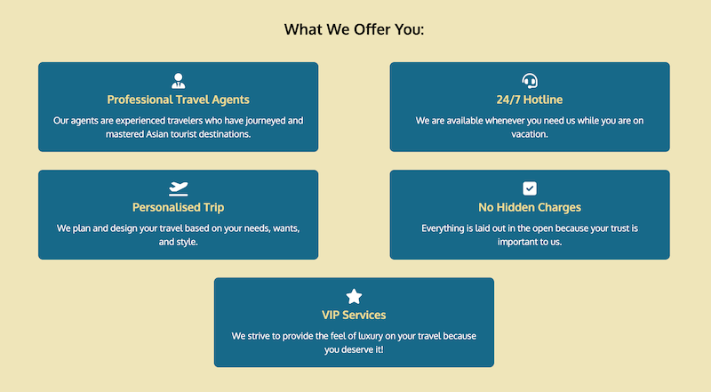
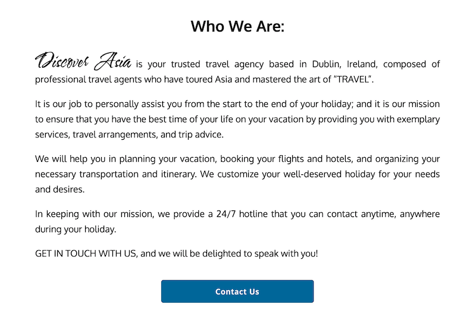
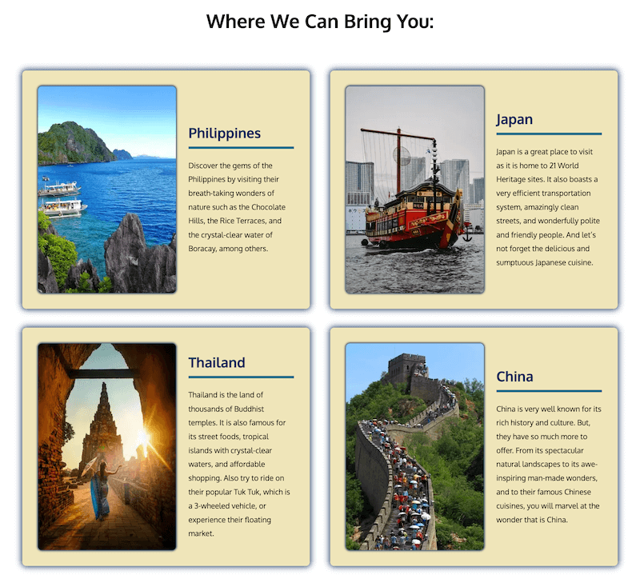
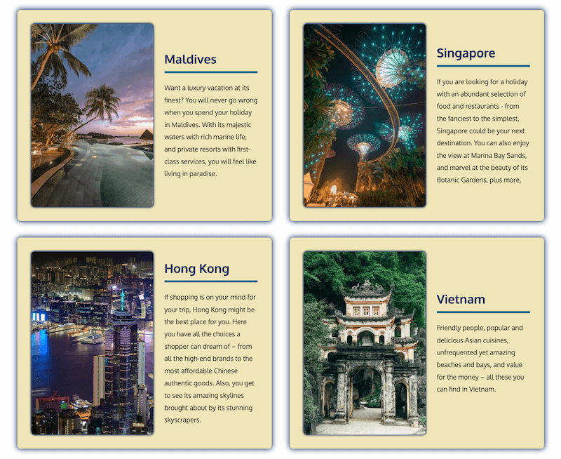
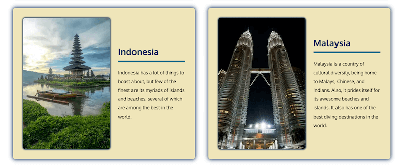
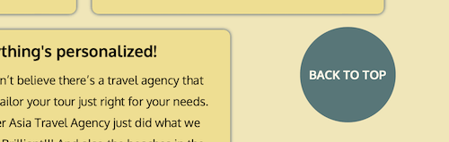

# DISCOVER ASIA TRAVEL AGENCY

Discover Asia is a travel agency website created to showcase to globetrotters and leisure travelers what this amazing agency can offer them for their next holiday trip. It desires to focus on holidaymakers who don't just want to simply travel, but to travel with convenience, style and luxury through the agency's personalized VIP services. And it aims to entice luxury travelers to choose Asia and get in touch with Discover Asia by presenting it with the utmost consideration for user experience. View live website here: [Discover Asia](https://marked-gil.github.io/discover-asia/)

---
## Features
---
### Existing Features

* **Navigation Bar**

    The navigation bar contains 2 main divisions of links to other pages or major sections of the website - the **logo** and the **nav menu**. This navigation bar is displayed in all pages of the website for easy and convenient routing.

    

    * Logo
    
        The logo, when clicked or tapped, links back to the home page. And it is created using Water Brush and Oxygen font families.

        

    * Nav Menu

        The nav menu is composed of links to the Home page, Destinations page, 'About Us' section, and 'Contact Us' page.

        

* **Home Page Banner**

    The banner in the Home page is laid out with a background image of the tranquil picture of Maldives, an autoplayed video (without audio, but with controls) of a resort along the beach, a tagline that succintly describes the company and what it does, and also a trustpilot rating to add credibility. All of these elements fused together paints a picture of a luxury travel agency with topnotch focus on details and excellence.

   
    * Tagline
        
        'Travel in Style, Travel Asia, Travel with Us!' tagline briefly and clearly explains the company in few words.

    * Background Image

        The picture of Maldives is chosen as background image as it represents luxury, paradise and tranquility, which is what Discover Asia is seeking to provide to all its holidaymakers.

    * Banner Video

        An audio-less looping video of a resort beside the beach is added to give an extra feel of sophistication to the website. This video has controls and is user-initiated to play.

    * Trustpilot Rating

        The display of an excellent trustpilot rating in the banner helps build confidence for the company by the clients who visit the site.

    

* **'What We Offer' section**

    In this section, five (5) immensely significant and especially important services of the company are presented in a concise and easy-to-understand style by providing keywords and single-sentence explanations. And this is designed to be clutter-free and simple to keep client's focus when viewing this part.

    

* **'Our Top Destinations' section**

    This section displays images of the six (6) most popular countries in Asia where the travel agency can bring its clients. These are the countries that clients love to visit the most. At the bottom of it is a button that links to the Destinations page for clients who are interested to see all the other countries where Discover Asia can bring them.

    

* **'What Our Clients Say About Us' section**

    Company reviews by clients are displayed on this part of the Home page. This adds to the company's authenticity and reliability, thus bolsters the credence of users towards the company.

    

* **'Who We Are' section**

    This section presents a description of what and where Discover Asia is, the kind of professionals behind it, what it does, and why the company exists. Its content is written simply and short to easily convey a message and so as not to be overwhelming to a reader/user. At the bottom of the section is a button which links to the Contact Us page.

    

* **'Subscribe to Newsletter' section**

    In this area is situated an input field for email address for users who wish to subscribe to the agency's newsletter. It also contains a heading at the top to inform users of what it is for, a clearly worded label to instruct what to do, an input field where an email address goes into, and a submit button at the bottom. 

    

* **Footer**

    In the footer section is found Discover Asia's main office **map**, **address**, **email address**, **phone number**, **social media links**, and the **copyright**. This section is present in all pages of this website.

    * Map

        The map embedded in the footer section is from Google Maps, which allows the free use and embedment in a website. It is interactive as it can be zoomed in and out, and also it can be viewed in a larger map via its clickable link.

    * Main Office Location & Contacts

        The office address, email address, and phone number are grouped together.

    * Social Media Icons

        The social media links of Discover Asia are displayed through social media icons for Facebook, Twitter, Instagram, and Youtube. These icons when clicked or tapped will open in a separate window to prevent the disruption of browsing the main website of Discover Asia.

    * Copyright

        The copyright is located at the lowermost part of the footer. 

    

* **Destinations Page**

    The Destinations Page is where all the Asian countries that the agency is bringing its clients to are shown. Sample images of each country are displayed along with a short description of what each prides itself with. With this, users will be given a snippet of idea of what each country has in store for vacationers.
    
    As of the present, there are a total of ten (10) Asian countries that are included in the list.

    

    

    

* **Contact Us Page**

    The Contact Us Page begins with a call-to-action statement (Let's Plan Your Holiday!), followed by an instruction, and a form to be filled in.

    In the form, the user is required to provide their name, email, phone number, and destination of choice before they can submit their information. As an option, the user may also supply the time they are available to take phone calls, and a message.

    Before the form inputs can be submitted, user have to agree that a staff of the agency can contact them via the contact details they provide. This can be done by ticking the checkbox below the message field.

    

* **Sticky 'Back to Top' Button**   

    The sticky 'Back to Top' button is an accessible sticky button that stays at the right lower part of the viewport on both the Home and the Destinations pages. Its function is to bring the user back to the beginning of a particular page when this button is clicked or tapped. This functionality is most useful when the page is long and the user has scrolled too far.

    

* **404 Page**

    The 404 Page is presented with a simple statement that informs the user who have reached this page that either something has gone wrong when they were navigating the site or what they are looking for is just not in the site. And for the user to easily go back to the home page or even to other pages of the site, a 'Return to Home' button just after the statement is conveniently placed. Also, the navbar at the top is present.

    

* **Contact Form Submission Feedback Page**

    This page is to give immediate feedback to users who wish to contact the agency, by filling out the 'Contact' form and submitting it by clicking its'submit' button, that they have successfully submitted their details. Also, this page provides the following: (1) further information or instruction on what to expect next after the form has been submitted, and (2) an accessible 'Back to Home' button so the user can continue to navigate the site should he/she wishes so.

    

* **Newsletter Subscription Feedback Page**

    This feedback page is presented to the user who has successfully submitted their email address via the Newsletter Subscription section on the 'Home' page and 'Destinations' page. It provides him/her information that as their email address has been received, he/she is subscribed to the newsletter. Also, at the bottom of the statements is the 'Back to Home' button to allow the user to continue the visit to the site.

    

### Features Left to Implement

* To use a HAMBURGER MENU button using Javascript or Bootstrap to enhance responsiveness and style of the navbar.
* To display the client reviews in a carousel or slideshow especially when viewed in mobile devices.

___
## Design Wireframes
___
The following are the schematic blueprints, or wireframes, used to build this website. And these wireframes were created using [Balsamiq](https://balsamiq.com/).

### HOME PAGE 

* Large Screens (desktops | laptops | TV screens)

* Medium Screens (Small laptops | tablets | ipads)

* Small Mobile Devices (smart phones)

### DESTINATIONS PAGE

* Large Screens (desktops | laptops | TV screens)

* Medium Screens (Small laptops | tablets | ipads)

* Small Mobile Devices (smart phones)

### CONTACT US PAGE

### CONTACT FORM FEEDBACK PAGE

### NEWSLETTER FEEDBACK PAGE

### PAGE NOT FOUND PAGE (404)

---
## Testing
---
### Responsiveness

This website is made fully responsive from the largest screen to the smallest mobile screen size of 280px. 
* This was tested using the web developer tools on Chrome, Firefox, Microsoft Edge, and Safari. 
* Also, an online tool called ['Mobile-Friendly Test'](https://search.google.com/test/mobile-friendly) was used to test the site's mobile-friendliness as likely more people nowadays are using mobile devices to access the internet.
    
    
    
    

### Accessibility

As it is important that people with disabilities have the equal chance of using the web, this site also gives significant consideration to its accesibilitiy.

The site is made with concern for:
* Sufficient contrast between foreground and background colors,
* Distinctness of interactive elements, like links and buttons, through change of styling during mouse hover,
* Consistent placement and styles of similar links and buttons to avoid confusion and for easy navigation of the site,
* Clear association of labels to their respective input fields, such as positioning them adjacent to each other and connecting them with same IDs,
* Inclusion of immediate feedback mechanism through: 
    * Giving an immediate indication or warning, which is browser dependent, next to the input field when the form is submitted without completing the required input field. This is setup by adding the 'required' attribute in the input fields that are necessary to be filled before the form can be submitted.
    * Using a separate feedback page that will show a response when a form (e.g., contact-us form) or input field (e.g., newsletter subscription field) is successfully submitted, and
* The use of **alt** texts on images, and **aria-label** on certain links (such as the social media icons).

To ensure that most of the items mentioned above are achieved, the [WAVE - Web Accessibility Evaluation Tool](https://wave.webaim.org/) was utilized through the development of this website.   

### Links/Buttons Functionality Testing     

 * This website was **manually tested** on different browsers (Chrome, Firefox, Microsoft Edge, and Safari) and have been confirmed that all links and buttons are working as intended and are redirecting to the appropriate pages or sections.

### Validator Testing

* HTML
    * Using [W3C Markup Validator](https://validator.w3.org/), there are NO ERRORS FOUND in the use of HTML in the site.    
    
        Home Page   
            

        Destinations Page   
            

        'Contact Us' Page   
            

        Contact Form Feedback Page  
           

        Newsletter Feedback Page    
             

        404 Page    
        

* CSS
    * Using [W3C CSS Validator](https://jigsaw.w3.org/css-validator/), there are NO ERRORS FOUND in the CSS of the site.    

        

### Lighthouse Testing

* On Desktop   

    
    
    

* On Mobile

    
    
    

### Fixed Bugs

* **ISSUE:**    
    At max-width: 1029px, the sticky 'Back to Top' link became positioned behind 'Top Destinations' images, thus concealing part of the 'Back to Top' link.

    * **INTENDED OUTCOME:**     
        What I expect the 'Back to Top' link to do is to always stay infront of all elements so it is always 'clickable' wherever in the page it is seen.

    * **SOLUTION:**    
        I found out that the images were given a z-index of 1, also the texts on top of the images have z-index of 2. And so, to fix it, I gave the 'Back to Top' link a z-index of 3. So now the 'Back to Top' link is always in front of any element.

* **ISSUE:**   
    My images in 'Top Destinations' section had an extra (unwanted) space/gap between its bottom border and that of the containing block despite giving the width of 100% to the image.

    * **INTENDED OUTCOME:**
        I expect the images to completely fill their immediate containers without gaps or spaces between them.

    * **SOLUTION:**     
        After researching the internet for a solution, I found in Stackoverflow an explanation for it, which is a reminder that an img is an inline element. That being so, it sits on a line where its 'descenders', which extend below the baseline like the letters in the alphabet, will create an extra space below it. So, to solve the problem, I modified the particular image elements as 'block' elements using 'display: block'.
        
        Here is the link for the Stackoverflow explanation: [Stackoverflow](https://stackoverflow.com/questions/5804256/image-inside-div-has-extra-space-below-the-image).

* ISSUE:    
    The text contents of the BUTTONS of particular sections move slightly downward and the page along with it during hover.

    * **INTENDED OUTCOME:**    
        I want the 'background color' and 'text color' of the button to switch and a '3px solid border' to be created during hover, without affecting or changing the width and/or height of the button. Also, I do not want the button to oddly move the page even slightly when button is hovered.

    * **SOLUTION:**     
        After realizing that a border has its own width and height, and could be the cause of increasing the lenght of the entire button during hover, I added 'box-sizing' property with value of 'border-box' on the hovered button so the height and width of the border that is created during hover will be contained or absorbed in the width and height of the button, and not be add in to it.

* **ISSUE:**    
    On the 'feedback pages' for Newsletter Subscription form and Contact Submission form, there is a gap between the bottom borders of the footer and the viewport which is evident when the window's height is increased. This happens as their main contents (which are texts only) are few and therefore cannot push the footer to the bottom of the viewport all the time. You can find these specific pages in these links: [Newsletter Form Feedback Page](https://marked-gil.github.io/discover-asia/subscription-feedback.html) | [Contact Form Feedback Page](https://marked-gil.github.io/discover-asia/contact-feedback.html)

    * **INTENDED OUTCOME:**
    I expect the footer to, at least, stay at the bottom of the viewport despite of the size of main content.

    * **SOLUTION:**     
    To solve the issue, I gave a height of 100% (height: 100%) on the html element; on the body element, I assigned a 'flex' value to the 'display' property(display: flex) with 'flex-direction' of 'column' (flex-direction: column) and a 'min-height' of 100% (min-height: 100%); and on the main content, I gave the 'flex' property a grow value of 1, a shrink value of 0, and a basis value of auto (flex: 1 0 auto). This then pushed the footer down to the very end despite the space occupied by the main content of the page. This solution was suggested by Brian Frain in his book entitled, **'Responsive Web Design with HTML5 and CSS'**.

### Unfixed Bugs

* In a Safari browser and in an iPhone (regardless of browser), when I tap on the 'Back to Top' button, it will create a blue border around the logo in the navbar.   

    Tests made:
    * On a DESKTOP and using Firefox, Edge, and Chrome browsers -> NO blue border around logo appears.
    * On a DESKTOP and using Safari browser -> Blue borders appears.
    * On an iPhone and using Firefox, Chrome, and Microsoft Edge browsers -> Blue borders appears.      

    The 'Back to Top' button is linked to the ID of the logo to bring the whole page back to the top, but the behavior of the logo in Safari and in iPhone is something I did not expect. I implemented the same method of linking one element to another element via their ID through the images of the 'Top Destinations', which will redirect to a specified section in the Destinations page. This one works fine and no unexpected issue unlike that of the logo and the 'Back to Top' button.    

    I am still looking for answers to this so I can fix this bug.

---
## Deployment
---

### Version Control

In the development of this website, **git** was a crucial tool used to track changes made in the repository. The following git commands were mostly used:      

* **git status** - to show the status of the repository by displaying the files that have been staged and ready for commit, those that are not, and those that are untracked.

* **git add \<file name>** - to add file or changes in the file to the staging area before they can be commited

* **git commit -m "message"** - to add/record file or changes to the local repository

* **git push** - to upload the local repository to the remote repository, such as GitHub

### GitHub Pages Deployment
The website is published on Github Pages. The following are the steps in deploying the site:
1. Inside the Github repository of 'discover-asia', click on 'Settings' on the menu just below the respository name.
2. Then, among the options on the left sidebar, click on 'Pages'.
3. On the right side of the sidebar, look for 'Source', and under that is a dropdown menu for 'Branch'.
4. Click on the dropdown menu for Branch, and select 'main'.
5. Then, click 'Save' button. The deployed website will be 'live' after few minutes.

The live link to the Discover Asia website is found here: **[Discover Asia](https://marked-gil.github.io/discover-asia/)**.

___
## Technologies
___

This website uses the following technologies:

* **Languages:**    
    This website is created using only 2 languages:
    * **HTML** - or *'Hypertext Markup Language'*, is used to build the structure of the web page while utilizing its semantic elements.

    * **CSS** - or *Casscading Style Sheets*, is used to style the look or presentation of the webpage. Layout methods such as Flexbox and Grid layout are utilized.

* **Gitpod**.  
    Gitpod is the cloud-based IDE (Integrated Developer Environment) used to build this site.

* **Git**  
    Git, as a version control system, is made use of to monitor and record changes made when building the site. This allows for the restoration of an earlier version of the code should it be necessary.

* **GitHub**    
    The created source code to build this website is stored in GitHub as a repository.

* **GitHub Pages**  
    The website is hosted live in the web through GitHub Pages, which is a hosting site for static web pages, via GitHub.

* **Google Fonts**  
    Main fonts used are: **Water Brush** (for the logo) and ***Oxygen** (for the main texts). These are imported from [Google Fonts](https://fonts.google.com/).

* **Font Awesome**  
    The icons for the social media links in the footer section, and the icons in the 'What We Offer' section are from imported from [Font Awesome](https://fontawesome.com/).

**Favicon.io**    
    Favicon is the icon displayed beside the site title, usually seen in the browser tab. The customized favicon used in this website is from [Favicon.io](https://favicon.io/).

* **Balsalmiq**     
    Generating the structure of the design concept was done with wireframes from [Balsalmiq](https://balsamiq.com/).

* **Tinypng**
    To improve the performance of the site, the images were compressed through [TinyPNG](https://tinypng.com) to reduce their file size.

* **Convertio**
    * To convert jpeg images to webp format files, [Covertio](https://convertio.co/jpg-webp/) was used.

---
## Credits
---
### Content

* **Texts**     
    The text contents of the website are originally written for the site by me - the creator.   

    For the DESTINATION page's main content (such as the description for each country) to be factual, I have researched on multiple sites, especially travel websites, where I based most of the texts from.
    
* **References: Go-to Sites for CSS & HTML**    
    My main reference for learning and reviewing CSS and HTML are:
    * [W3schools](https://www.w3schools.com/), 
    * [MDN](https://developer.mozilla.org/en-US/), and 
    * [Code Institute's](https://codeinstitute.net/ie/) lectures.   

* **'Responsive Web Design with HTML5 and CSS by Ben Frain'** Book

    The idea on how to keep the footer at the bottom edge of the viewport (i.e. when there is no sufficient main content to push the footer at the endmost part) is from this book of Ben Frain. This is useful on the 'form submission feedback' page and the 'subscription feedback' page where the contents do not always have enough height, especially on large screens, to stick the footer at the bottommost part. (See solution and explanation on the **'Fixed Bugs'** section).
    
### Media

* Images
    * All the pictures displayed on the website are taken from free stock photography websites. Most are from [Pexels](https://www.pexels.com/), a few are from [Pixabay](https://pixabay.com/), and the banner background image is a photo by 'yang wewe' from [Unsplash](https://unsplash.com/).

* Video
    * The video displayed in the banner is taken from [Pexels](https://www.pexels.com/).

* [Google Map](https://google-map-generator.com/)
    * The map used in the footer section is generated using **Google Map**.